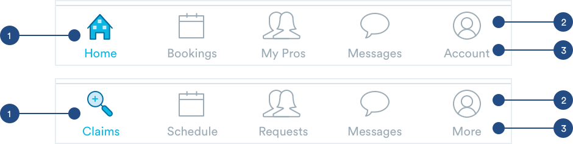

# Navigation

## Navigation

The navigation bar contains link to other pages of the app.



1. Selected: When a user is on a page, icon will be replaced with it's active state.

2. Unselected: Default state of icon

3. Structure: 

```text
max-width: 100%
max-height: 50px
border-top: 1px, light-slate
```

### Active Icon States

Folders include PNGs, SVG, and PDF files of each icon.











### Inactive Icon States

Folders include PNGs, SVG, and PDF files of each icon.











