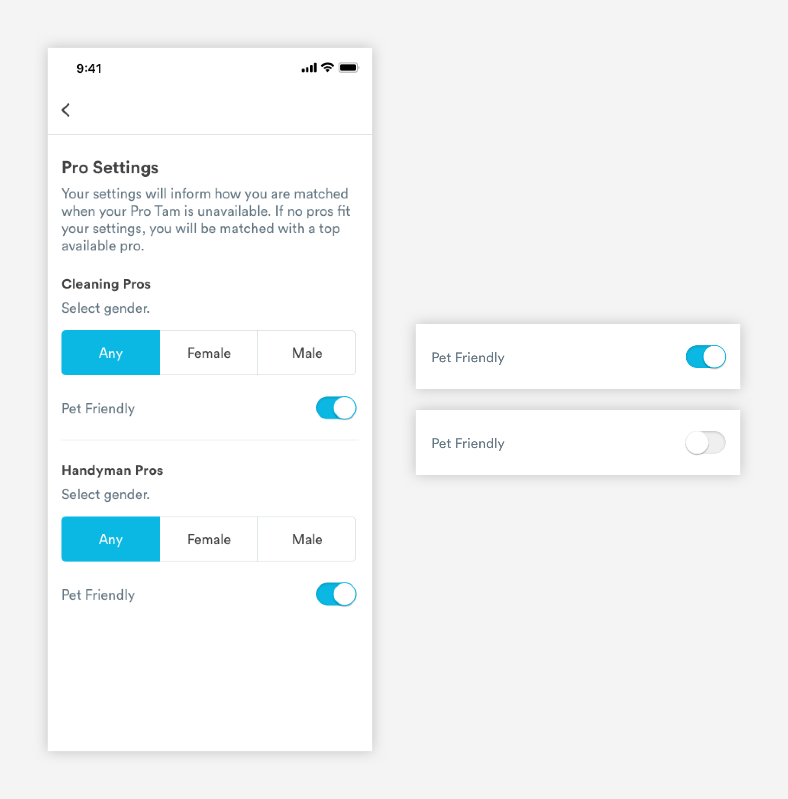

# Pickers

## Usage of Pickers

Pickers allow users to select an option \(or options\) before taking an action. Pickers can be found on booking flows and filters.


## Types of Pickers

\*\*\*\*[**1. Radio Pickers \(picker-radio\)**](pickers.md#radio-groups)


\*\*\*\*[**2. Checkboxes \(picker-checkboxes\)**](pickers.md#checkboxes)


\*\*\*\*[**3. Filter \(picker-filters\)**](pickers.md#filter)


\*\*\*\*[**4. Toggle \(picker-toggle\)**](pickers.md#toggle)\*\*\*\*



## Radio Pickers \(picker-radio\)

Radio buttons describe complex choices or provide all the available options next to each other. Radio groups must be stacked vertically.


**1. Current Selection**

```text
border: 1px
border-color: blue-medium
size: 24px

Fill:
color: blue-medium
size: 16px

padding-left: 16px
paddig-right: 16px
padding-top: 16px
```

**2. Content Header \(a-text-paragraph\)**

```text
font-weight: book
font-size: 16px
font-color: text-black
```

**3. Supporting Content \(a-text-paragraph\)**  
Supporting Content is optional and used to give extra information about that particular option.

```text
font-weight: book
font-size: 16px
font-color: slate-dark
```

**4. Unselected Option:**

```text
border: 1px
border-color: slate-medium
size: 24px
```

**5. Dividing Line**

```text
border: 1px
color: slate-light
width: 343px

padding-top: 16px
```

## Checkboxes

Checkboxes have the same structure as radio groups but are only used when the user can select multiple options. Each checkbox is independent of all other checkboxes in the list.


**1. Current Selection**

```text
border-radius: 3px
color: blue-medium
size: 24px

font-awesome: check
font-weight: regular
font-size: 16px
padding: 4px

padding-left: 16px
paddig-right: 16px
paddig-top: 16px
```

**2. Content Header \(a-text-paragraph\)**

```text
font-weight: book
font-size: 16px
font-color: text-black
```

**3. Supporting Content \(a-text-paragraph\)**  
Supporting Content is optional and used to give extra information about that particular option.

```text
font-weight: book
font-size: 16px
font-color: slate-dark
```

**4. Unselected Option**

```text
border radius: 3px
border: 1px
border-color: slate-medium
size: 24px
```

**5. Dividing Line**

```text
border: 1px
color: slate-light-medium
width: 343px

padding-top: 16px
```

## Filter

Filter pickers are used when the user can only select one option. Unlike radio groups, filter options are short \(can only be one word or number\) and there are less than 5 options in total.


**1. Selection**  
Filter pickers always have a default selection. Color is used to denote a selection.

```text
Fill Color: 
background: blue-medium [selected]
background: white [unselected]

Text (a-text-paragrah)
font-weight: book
font-size: 16px
text-color: white [selected]
text-color: text-black [unselected]

padding-left: 10px
padding-right: 10px
padding-top: 16px
padding-bottom: 16px
```

**2. Corner Radius**

```text
border-radius: 5px
```

**3. Structure**

```text
border: 1px
border-color: slate-medium
max-width: 343px


padding-top: 16px
padding-bottom: 16px 
```

## Toggle

Toggles are used specifically for settings & preferences \(Account, Pro Settings\) when the user has a choice turning a certain state on or off.


1. Pill Structure: Off

```text
Pill
max-height: 26px
max-width: 46px
box-shadow: inset 0px 1px 3px rgba(0, 0, 0, .2)

Circle
border: 1px
box-shadow: 0px 1px 1px rgba (0, 0, 0, .2)
```

2. Pill Structure: On

```text
Pill
max-height: 26px
max-width: 46px
color: blue-medium
box-shadow: inset 0px 1px 3px rgba(0, 0, 0, .2)

Circle
border: 1px
border-color: blue-medium
box-shadow: 0px 1px 1px rgba (0, 0, 0, .2)
```


