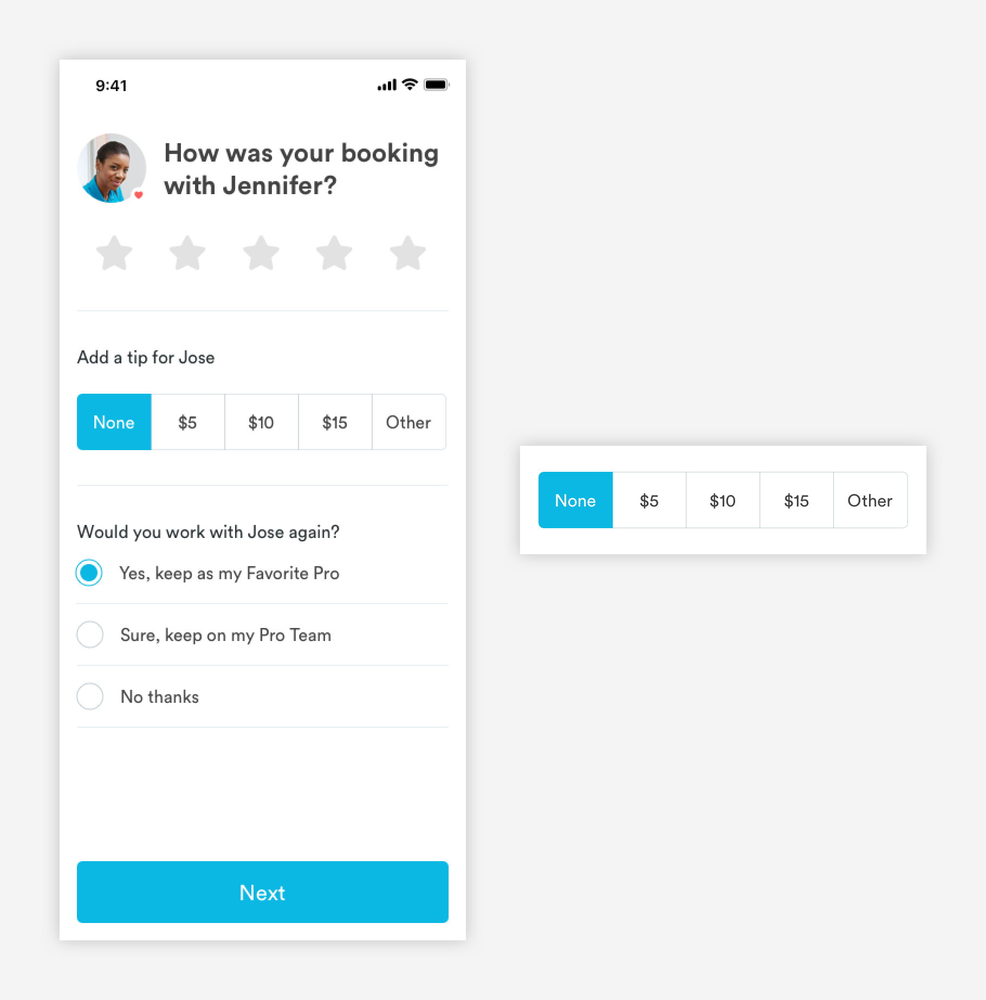

# Pickers

## Usage of Pickers

Pickers allow users to select an option before taking an action. Pickers can be found on booking flows and filters.


## Types of Pickers

\*\*\*\*[**1. Radio Pickers \(a-picker-radio\)**](pickers.md#radio-groups)


\*\*\*\*[**2. Checkboxes \(a-picker-checkboxes\)**](pickers.md#checkboxes)


\*\*\*\*[**3. Filter \(a-picker-filters\)**](pickers.md#filter)



\*\*\*\*[**4. Toggle \(a-picker-toggle\)**](pickers.md#toggle)\*\*\*\*


## Radio Groups

For example, selecting bedrooms in the booking flow. Radio buttons describe complex choices or provide all the available options next to each other. Radio groups must be stacked vertically.


1. Current Selection:

```text
border: 1px
border-color: blue-medium

Fill:
color: blue-medium
size: 16px
```

2. Unselected Option:

```text
border: 1px
border-color: slate-medium
```

3. Dividing Line:

```text
border: 1px
color: slate-light
width: 343px
```

## Checkboxes

Checkboxes are used when the user can select multiple options. For example, adding extras in the booking flow. Each checkbox is independent of all other checkboxes in the list.


1. Current Selection: There can be multiple selections.

```text
border-radius: 3px
color: blue-medium
```

2. Option:

```text
border radius: 3px
border: 1px
border-color: slate-medium
```

3. Dividing Line:

```text
border: 1px
color: slate-light-medium
width: 343px
```

## Filter

Filter pickers are used when the user can only select one option, the options are short \(only one word or number\) and there are less than 5 options in total.


1. Current Selection: There cannot be multiple selections

```text
fill: blue-medium
text: Circular-book
text-color: white
```

2. Corner Radius

```text
border-radius: 5px
```

3. Structure

```text
border: 1px
border-color: slate-medium
max-width: 343px

Text:
padding-top: 16px
padding-bottom: 16px 
text-color: text-black
```

## Toggle

Toggles are used specifically for settings & preferences \(Account, Pro Settings\) when the user has a choice turning a certain state on or off.


1. Pill Structure: Off

```text
Pill
max-height: 26px
max-width: 46px
box-shadow: inset 0px 1px 3px rgba(0, 0, 0, .2)

Circle
border: 1px
box-shadow: 0px 1px 1px rgba (0, 0, 0, .2)
```

2. Pill Structure: On

```text
Pill
max-height: 26px
max-width: 46px
color: blue-medium
box-shadow: inset 0px 1px 3px rgba(0, 0, 0, .2)

Circle
border: 1px
border-color: blue-medium
box-shadow: 0px 1px 1px rgba (0, 0, 0, .2)
```


