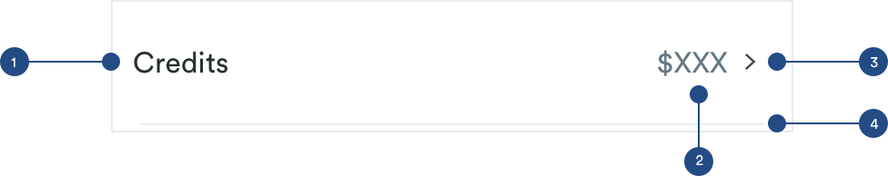

# Settings

## Settings

Settings components can be stacked to make a list on pages where users can take multiple actions. The list should be easy to scan and should have a clear label. 



## Anatomy of Settings


**1. Title \(a-text-paragraph\)**

```text
font-weight: book
font-size: 16px
font-color: text-black

padding-left: 16px
pading-top: 24px
padding-bottom: 24px
max-width: 65.89% (226px)
```

**2. Supporting Information \(optional\):**

```text
font-size: 16px
font-weight: book
font-color: #667884
padding-right: 8px

max-width: 27.4% (94px)
```

**3. Arrow \(a-nav-right\)**

```text
padding-right: 16px
```

**4. Divider \(a-divider-light\)**

```text
a-divider-light:
max-width: 343px
max-height: 1px
color: slate-light

padding-top: 24px
```

