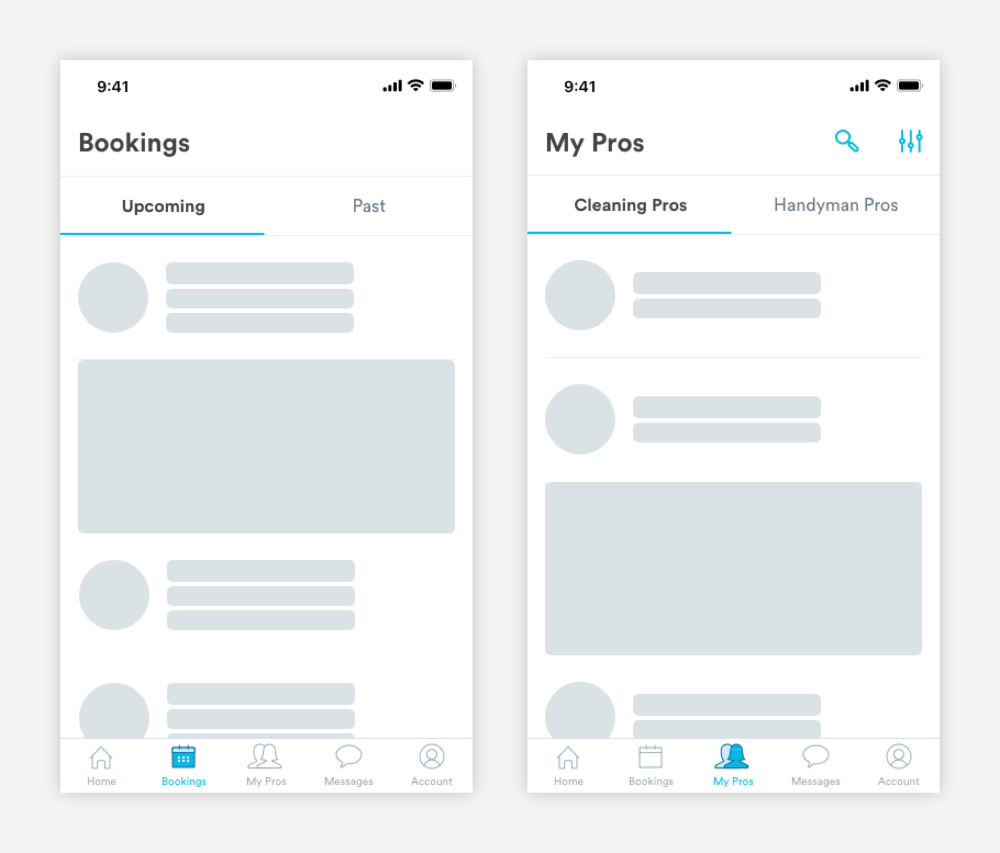
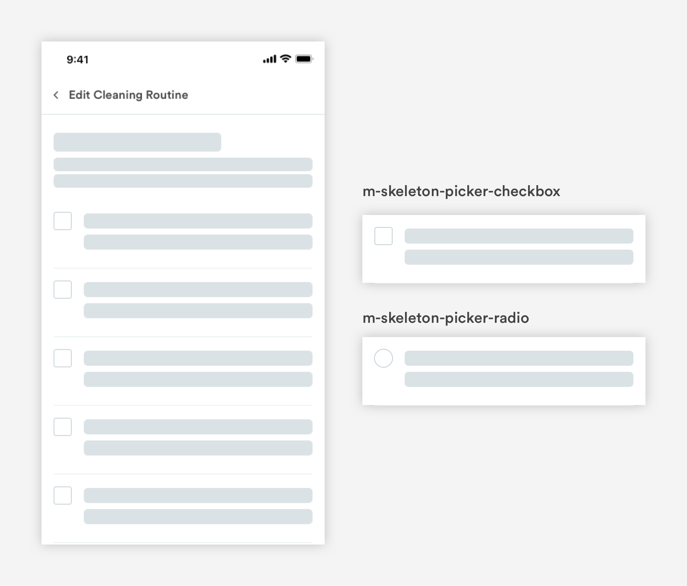
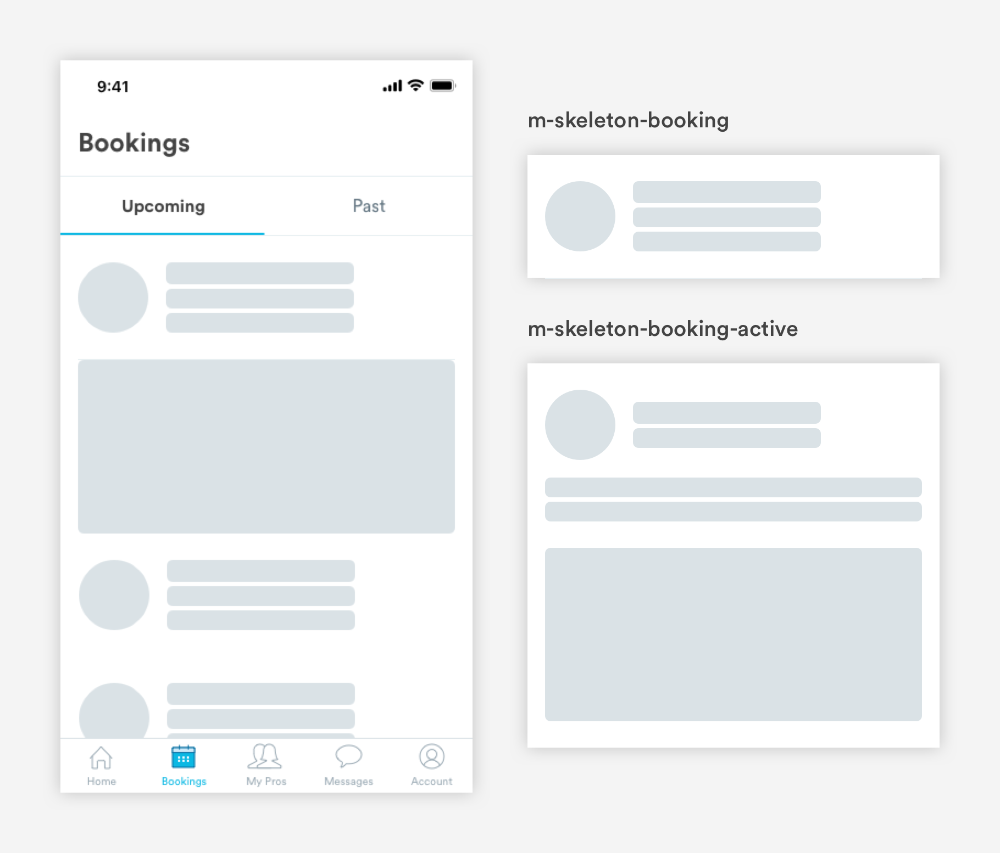
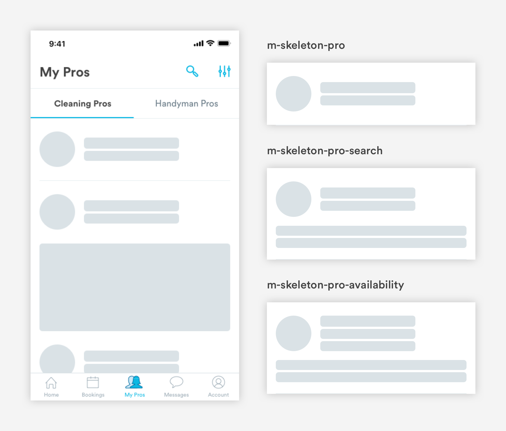
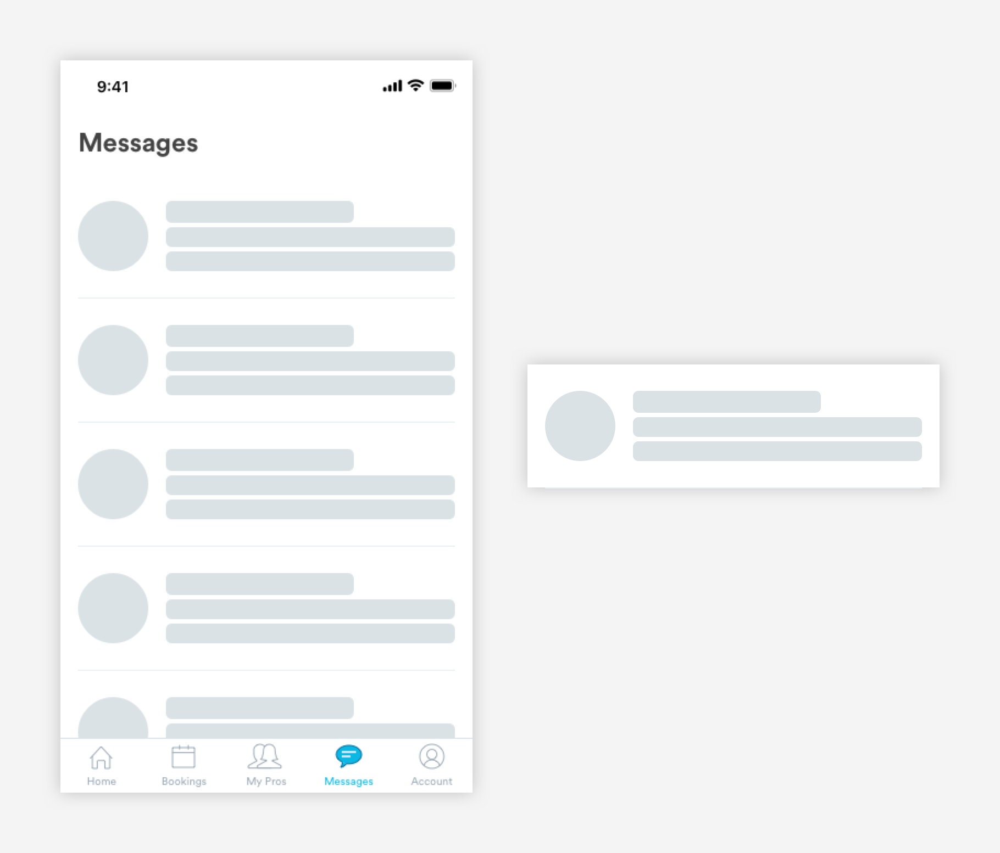
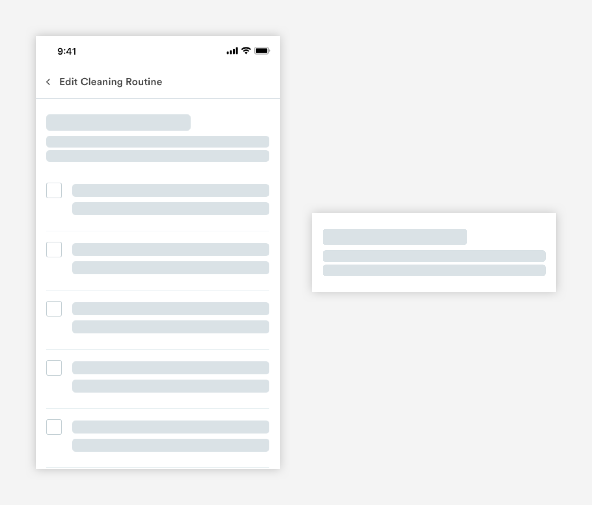
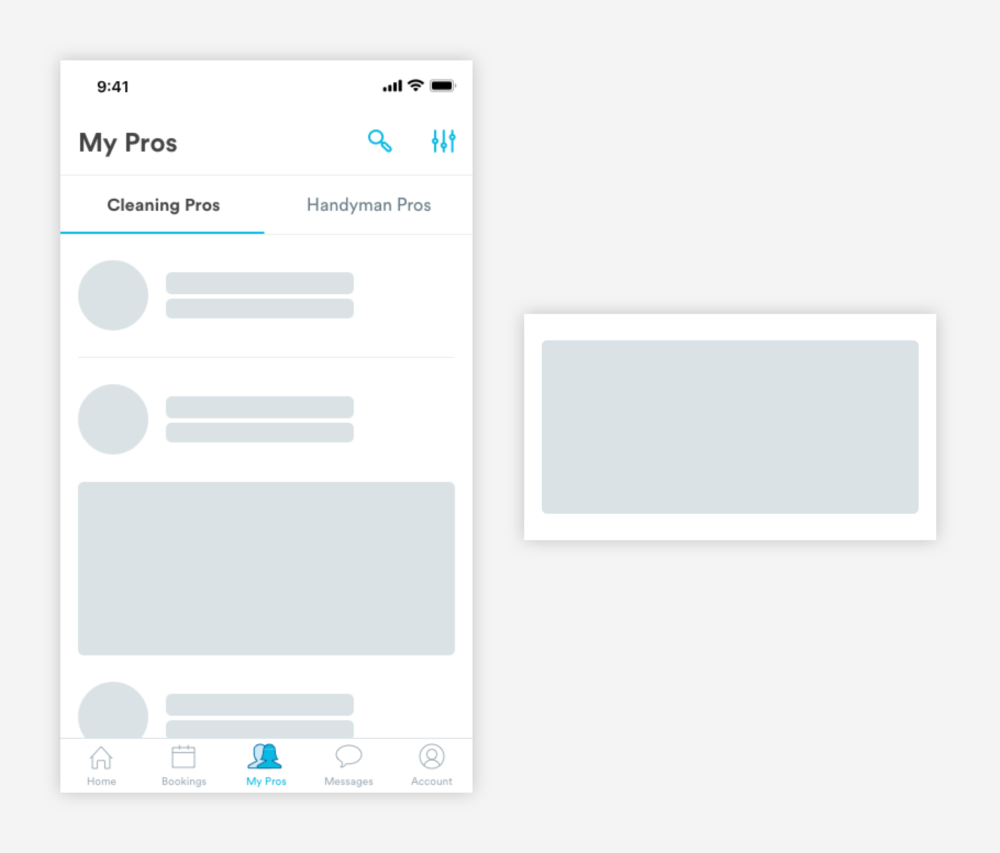
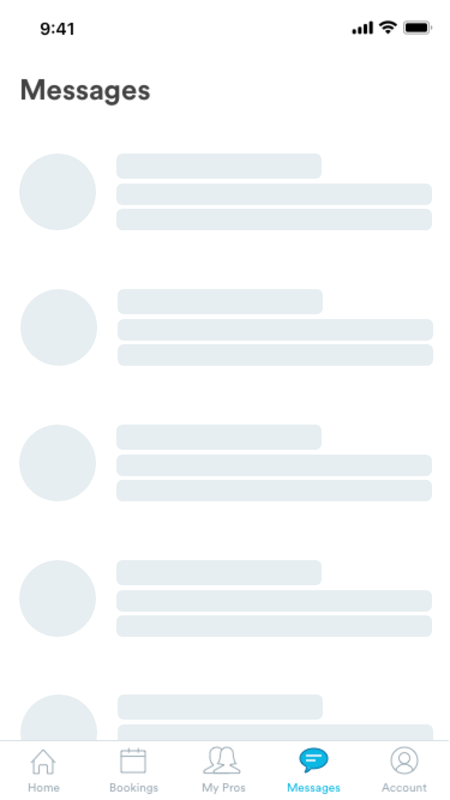

# Skeleton Loading States

## Usage of Loading States

Whenever the app is loading a page, components on the page will have a load state.

## Types of Loading States

**1. Picker Loading States \(skeleton-picker\)**

**2. Booking Loading State \(skeleton-booking\)**

**3. Pro Loading State \(skeleton-user\)**

**4. Message Loading State \(skeleton-message\)**

**5. Text Loading State \(skeleton-text\)**

**6. Image \(skeleton-image\)**  
Can be used for maps and product marketing content

## Animation

