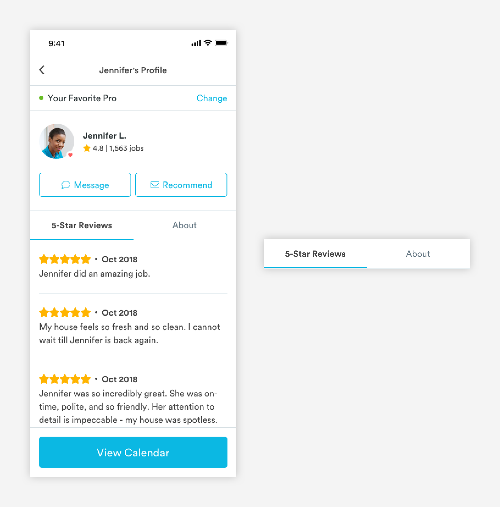

# Tabs

## Tabs

Tabs allow users to view content without having to navigate away from that page. Good way to organize related content on a page.



1. Selected 

```text
font-weight: bold
font-size: 16px
font-color: text-black
```

2. Unselected

```text
font-weight: book
font-size: 16px
font-color: medium-dark-slate
```

3. Indicator

```text
color: medium-handy-blue
max-width: 50%
max-height: 2px
```

