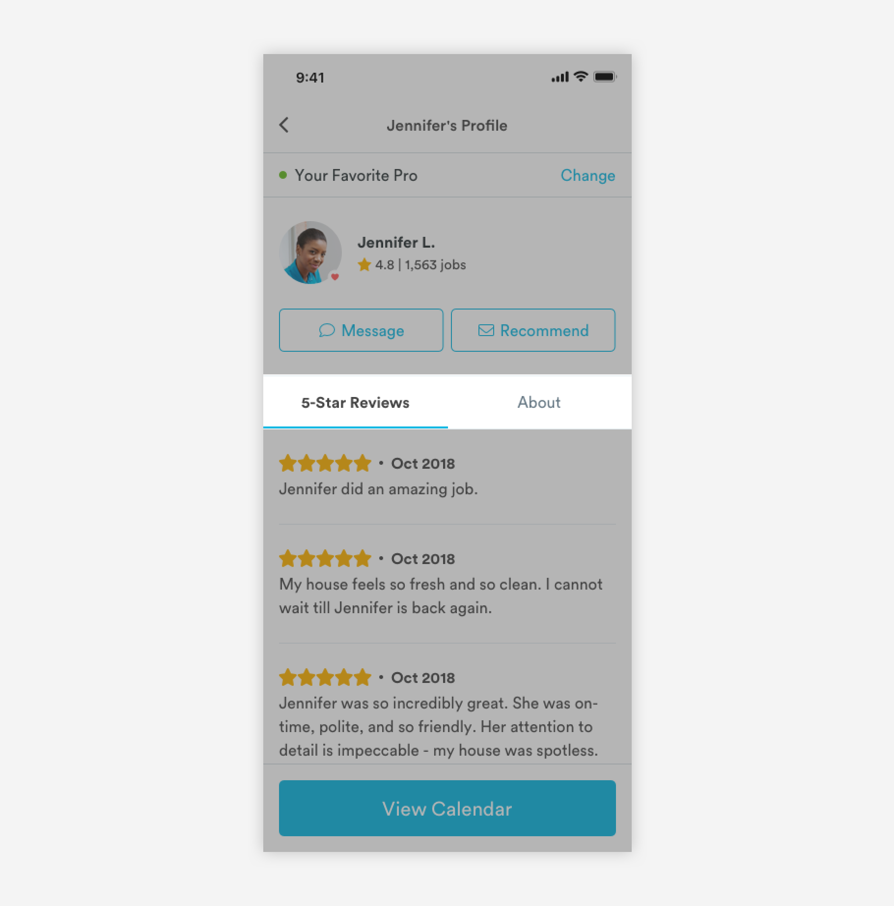

# Tabs

## Usage of Tabs

Tabs organize and allow navigation between groups of content that are related and at the same level of hierarchy. 



## Anatomy of Tabs

Tabs allow users to view content without having to navigate away from that page. Good way to organize related content on a page.


1. Selected 

```text
font-weight: bold
font-size: 16px
font-color: text-black

padding-top: 16px
```

2. Unselected

```text
font-weight: book
font-size: 16px
font-color: medium-dark-slate

padding-top: 16px
padding-bottom: 18px
```

3. Indicator

```text
color: medium-handy-blue
max-width: 50%
max-height: 2px

padding-top: 16px
```

