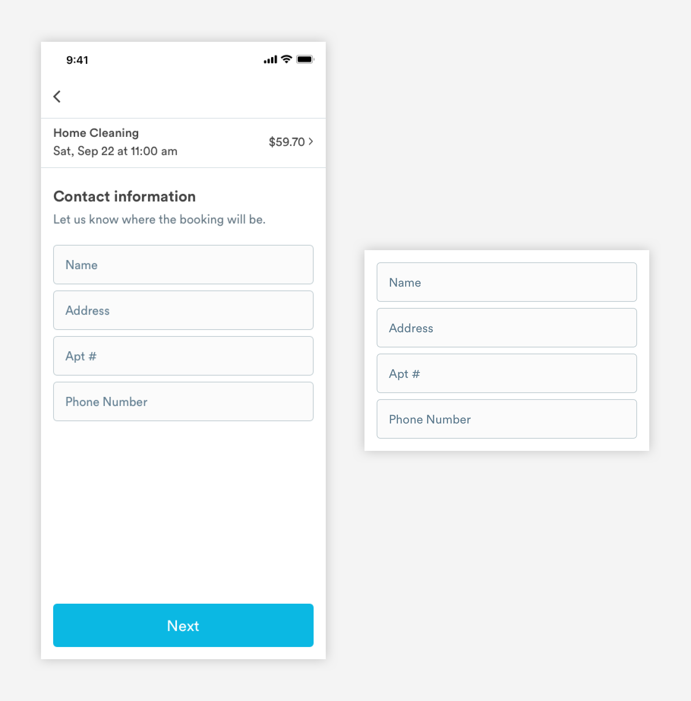

# Input Fields

## Usage of Input Fields

Input fields allow users to enter text. Input fields are normally found within a form.


## Types of Input Fields

\*\*\*\*[**1. Unfilled Input**](text-field.md#anatomy-of-unfilled-text-field-input-size-unfilled)\*\*\*\*



\*\*\*\*[**2. Unfilled Input Field - Error State**](text-field.md#anatomy-of-unfilled-text-field-error-state-input-error-size-unfilled)\*\*\*\*


\*\*\*\*[**3. Filled Input Field**](text-field.md#anatomy-of-filled-input-fields-input-size-filled)\*\*\*\*


\*\*\*\*[**4. Filled Input Field - Error State**](text-field.md#anatomy-of-filled-text-field-error-state-input-error-size-filled)\*\*\*\*


## Anatomy of Unfilled Text Field \(input-\[size\]-unfilled\)

The default state of a text field.


**1. Label/Placeholder Text \(a-text-paragraph\)  
I**ndicates what kind of information the field requires.

```text
font-weight: book
font-size: 16px
color: slate-medium-dark

padding-left: 16px
padding-right: 16px
padding-top: 16px
padding-bottom: 16px
```

**2. Structure**  
Container for content. Input fields can be at full or half width.

```text
border-radius: 5px
border: 1px
border color: slate-medium
background-color: off-white

max-height: 52px
max-width: 100% (343px)
min-width: 50% (168px)
```

## Anatomy of Unfilled Text Field - Error State \(input-error-\[size\]-unfilled\)


**1. Label/Placeholder Text \(a-text-paragraph\)  
I**ndicates what kind of information the field requires.

```text
font-weight: book
font-size: 16px
color: red-medium

padding-left: 16px
padding-right: 16px
padding-top: 16px
padding-bottom: 16px
```

**2. Structure**  
Container for content. Input fields can be at full or half width.

```text
border-radius: 5px
border: 2px
border color: red-medium
background-color: off-white

max-height: 52px
max-width: 100% (343px)
min-width: 50% (168px)
```

## Anatomy of Filled Input Fields \(input-\[size\]-filled\)


**1. Label \(a-text-label\)**  
Indicates what kind of information the field requires.

```text
font-weight: book
font-size: 10px 
color: slate-medium-dark

padding-left: 16px
padding-right: 16px
padding-top: 8px
padding-bottom: 3px
```

**2. Content \(a-text-paragraph\)**  
User generated text

```text
font-weight: book
font-size: 16px 
color: text-black

padding-left: 16px
padding-right: 16px
padding-bottom: 8px
```

**3. Structure**  
Container for content. Input fields can be at full or half width.

```text
border-radius: 5px
border: 1px
border color: slate-medium
background-color: off-white

max-height: 52px
max-width: 100% (343px)
min-width: 50% (168px)
```

## Anatomy of Filled Text Field - Error State \(input-error-\[size\]-filled\)


**1. Label \(a-text-label\)**  
Indicates what kind of information the field requires. Can be updated to include helper text.

```text
font-weight: book
font-size: 10px 
color: red-medium

padding-left: 16px
padding-right: 16px
padding-top: 8px
padding-bottom: 3px
```

**2. Content \(a-text-paragraph\)**  
User generated text.

```text
font-weight: book
font-size: 16px 
color: red-medium

padding-left: 16px
padding-right: 16px
padding-bottom: 8px
```

**3. Structure**  
Container for content. Input fields can be at full or half width.

```text
border-radius: 5px
border: 2px
border color: red-medium
background-color: off-white

max-height: 52px
max-width: 100% (343px)
min-width: 50% (168px)
```

## Animation

#### Long Form Text

When a user taps into a long form text field, any placeholder copy should disappear so the user can start typing.

#### Short Form Text

When a user taps into an unfilled short text field, the Label should animate up to the left hand corner of the container \(see example below\). 


