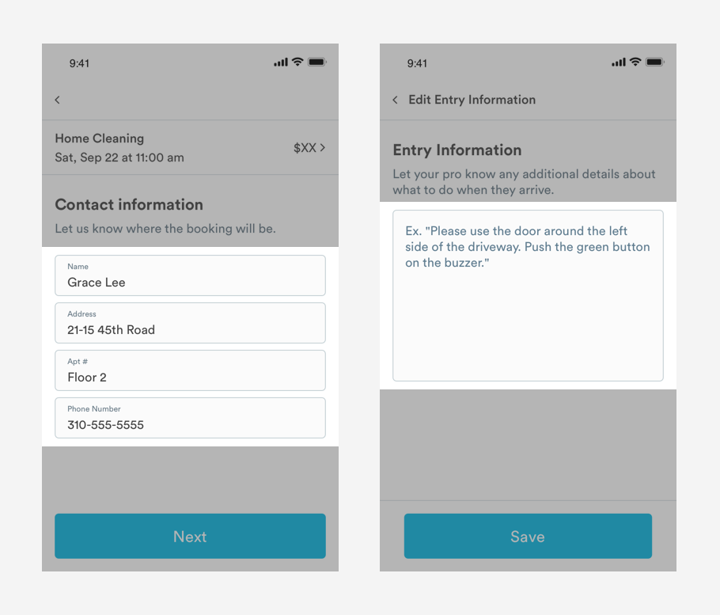

# Text Fields

## Usage of Text Fields

Text fields allow users to enter text. Text fields are normally found within a form.



## Types of Text Fields

### Unfilled Text Fields


**1. Label/Placeholder Text:** Indicates what kind of information the field requires.

```text
font-family: Circular
font-weight: Book
color: slate-medium-dark
active color: text-black
padding-left: 16px
padding-top: 16px
padding-bottom: 16px
```

**2. Structure:** Container for content

```text
border-radius: 5px
border: 1px
border color: slate-medium
```

**3. Input Area:** This is where people enter text

```text
background-color: off-white
```

### 

### Filled Text Fields


**1. Label:**  Indicates what kind of information the field requires.

```text
font-family: circular
font-weight: book
font-size: 10px 
color: slate-medium-dark
padding-left: 16px
padding-top: 8px
```

**2. Content:** User generated text

```text
font-family: circular
font-weight: book
font-size: 16px 
color: text-black
padding-left: 16px
padding-bottom: 8px
```

## Animation

#### Long Form Text

When a user taps into a long form text field, any placeholder copy should disappear so the user can start typing.

#### Short Form Text

When a user taps into an unfilled short text field, the Label should animate up to the left hand corner of the container \(see example below\). 


