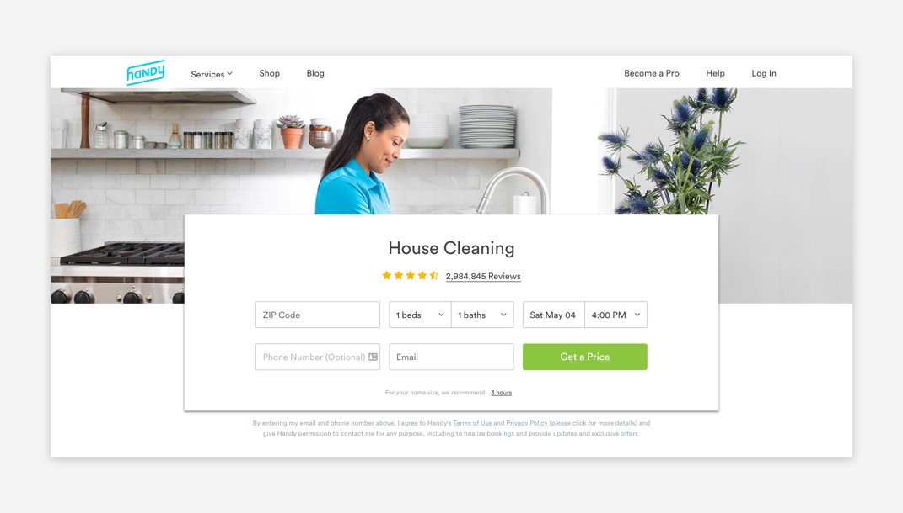
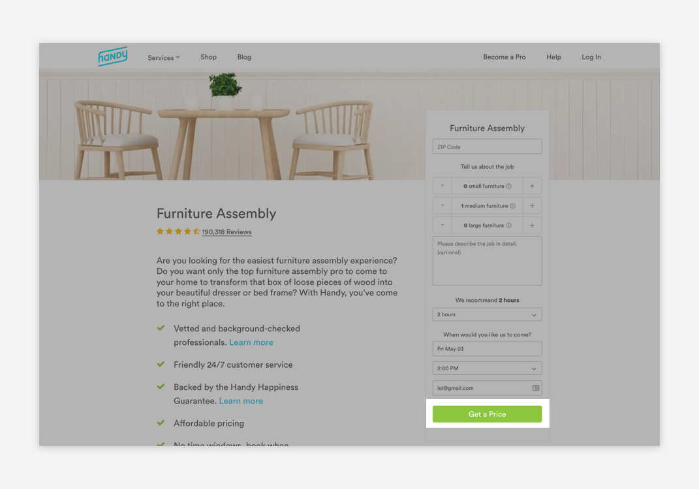
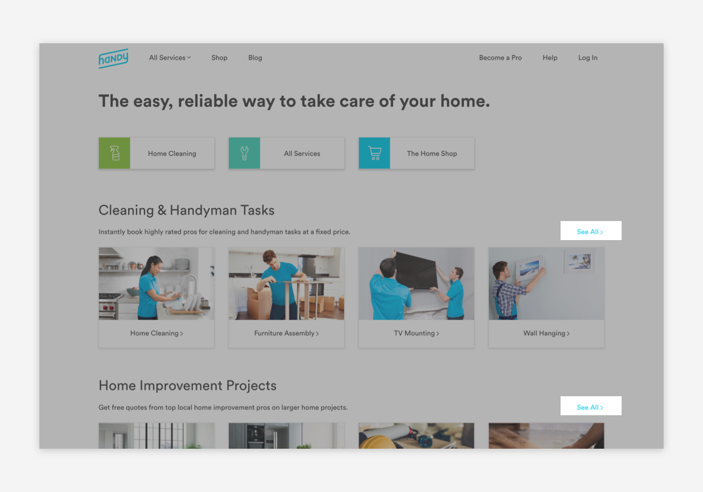
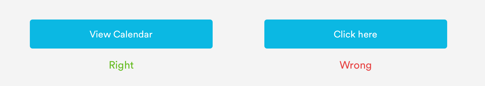
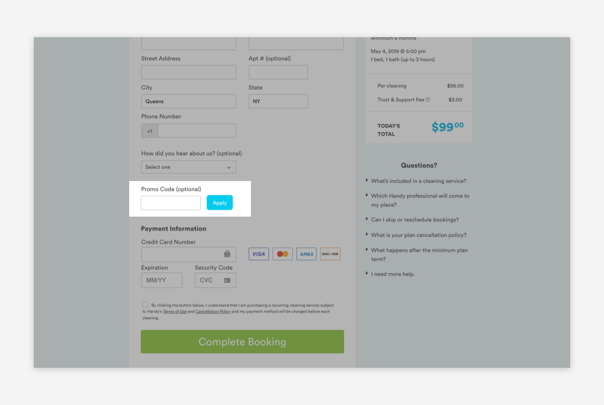
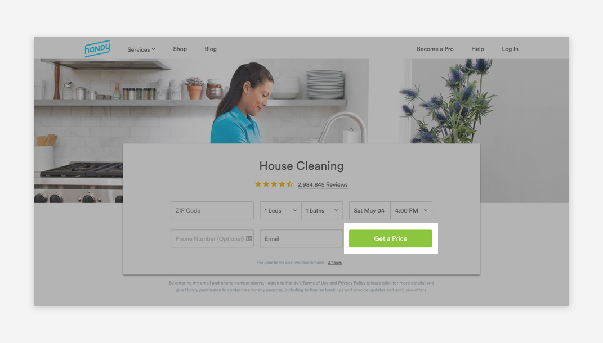
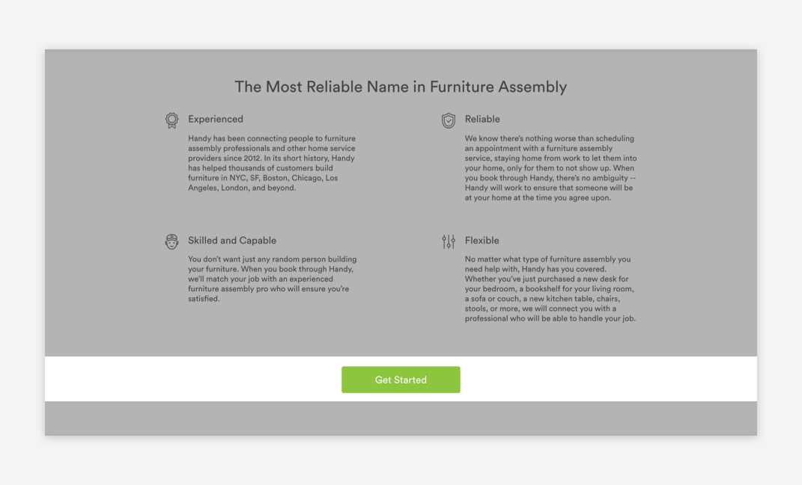
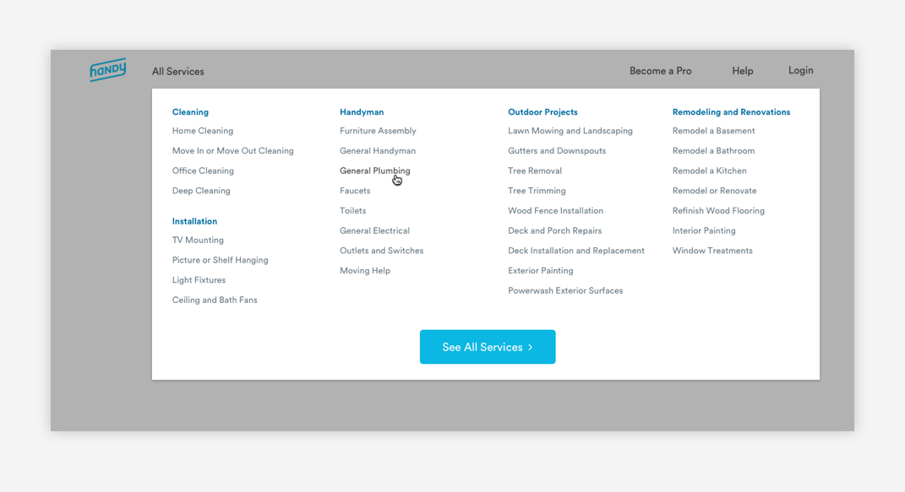

# Buttons

## Usage of Buttons

Buttons allow users to trigger an action like submitting information or confirming an action. They may take form in buttons or text links.



## Types of Buttons

[**1. Buttons**](buttons.md#buttons)\*\*\*\*



\*\*\*\*[**2. Text Links**](buttons.md#text-links)



## General Button Guidelines

1. Labels are always title case 
2. Labels clear and succinct 
3. Labels are verbs or adverbs that express the action the button will trigger
4. Icons links should only be used when representing common paradigms



## Buttons

Buttons are used to submit information or complete an action. Buttons come in 3 different sizes: Small, Standard, and Large.

### Small Buttons

Small buttons are used inline in forms like the Promo Code section in the Payment Page



#### Small Button Properties

```text
border-radius: 5px
border-color: blue-medium
font-family: Circular
font-size: 16px;
font-color: white
padding-top: 16px
padding-bottom: 16px
```

### Standard Buttons

Standard buttons are the most commonly used button style. They can be found on When Pages or with content. 



#### Standard Buttons Properties

```text
border-radius: 5px
border-color: blue-medium
font-family: Circular
font-size: 18px;
font-color: white
padding-top: 16px
padding-bottom: 16px
```

### Large Buttons

Large buttons can be used in content blocks or marketing cards.



#### Large Buttons Properties

```text
border-radius: 5px
border-color: blue-medium
font-family: Circular
font-size: 20px;
font-color: white
padding-top: 16px
padding-bottom: 16px
```

### Button Width Guidelines

Button widths will vary depending on the context. As a rule of thumb, please refer to our grid measurements for button widths. Buttons can be up to 3 columns wide.

## Text Links

Text links are used for non-essential actions, like changes to existing content, viewing another page.




#### Text Link Properties

```text
font: Circular-Book
font-size: 14px or 16px
font-color: blue-medium or slate-medium-dark
```

#### Text Link Hover State

```text
Hover State for Text Links starting as blue-medium:
font: Circular-Book
font-size: 14px or 16px
font-color: blue-medium-dark

Hover State for Text Links starting as slate-dark:
font: Circular-Book
font-size: 14px or 16px
font-color: text-black
```

