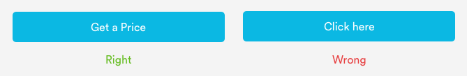
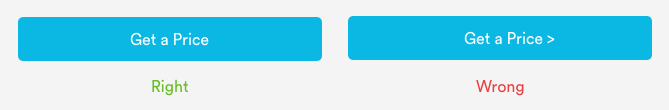
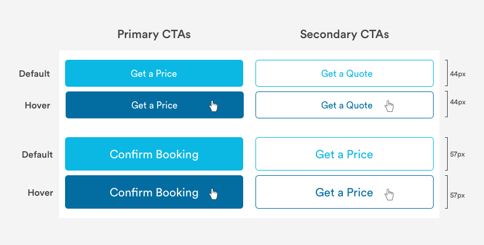

# Buttons

## General Button Guidelines

1. Labels are always title case. 
2. Labels are clear and succinct.
3. Labels are text only; characters, like carrots, are not used alongside text.
4. Labels are verbs or adverbs that express the action the button will trigger.
5. Icons links should only be used when representing common paradigms.





### 

## Button Width Guidelines

Button widths will vary depending on the context. As a rule of thumb, please refer to our grid measurements for button widths. Buttons can be up to 3 columns wide.

## Usage of Buttons

Buttons allow users to trigger an action, like submitting information or confirming an action. They may take form in buttons, text links, or icon links.


## Types of Buttons

\*\*\*\*[**1. Button CTAs**](buttons.md#button-ctas)\*\*\*\*

\*\*\*\*[**2. Text Links**](buttons.md#text-links)

\*\*\*\*[**3. Icon Links**](buttons.md#icon-links)\*\*\*\*

## Button CTAs

Button CTAs come in two sizes, Large and Small. Large CTA buttons are the primary CTA styles used across Desktop and Mobile Web. They are used when there is a main ask from the user that should be prioritized above other asks on the same page. Small CTA buttons \(less commonly used\) are available when there are multiple primary CTAs on the same page.



### Primary Button CTA

Primary button CTAs are used for the most important action on the page. These buttons are opaque and come in two sizes, large and small. 

#### Primary Large CTA Button Properties \(default\)

```text
max-height: 57px
border-radius: 5px
color: blue-medium
font-family: Circular
font-size: 20px
font-color: white
padding-top: 16px
padding-bottom: 16px
```

#### Primary Large CTA Button Properties \(on hover\)

```text
max-height: 57px
border-radius: 5px
color: blue-dark
font-family: Circular
font-size: 20px
font-color: white
padding-top: 16px
padding-bottom: 16px
```

#### Primary Small CTA Button Properties \(default\)

```text
max-height: 44px
border-radius: 5px
color: blue-medium
font-family: Circular
font-size: 16px
font-color: white
padding-top: 12px
padding-bottom: 12px
```

#### Primary Small CTA Button Properties \(on hover\)

```text
max-height: 44px
border-radius: 5px
color: blue-dark
font-family: Circular
font-size: 16px
font-color: white
padding-top: 12px
padding-bottom: 12px
```

### Secondary Button CTAs

Secondary button CTAs are used for subordinate actions on the page. These buttons are transparent with an outline and come in two sizes, Large and Small. 

#### Secondary Large Button CTA Properties \(default\)

```text
border-radius: 5px
border-color: blue-medium
font-family: Circular
font-size: 20px;
font-color: blue-medium
padding-top: 16px
padding-bottom: 16px
```

#### Secondary Large Button CTA Properties \(on hover\)

```text
border-radius: 5px
border-color: blue-medium
font-family: Circular
font-size: 20px;
font-color: blue-dark
padding-top: 16px
padding-bottom: 16px
```

#### Secondary Small Button CTA Properties \(default\)

```text
border-radius: 5px
border-color: blue-medium
font-family: Circular
font-size: 16px;
font-color: blue-medium
padding-top: 14px
padding-bottom: 14px
```

#### Secondary Small Button CTA Properties \(on hover\)

```text
border-radius: 5px
border-color: blue-dark
font-family: Circular
font-size: 16px;
font-color: blue-dark
padding-top: 14px
padding-bottom: 14px
```

>

## Text Links

Text links are used for non-essential actions, like changes to existing content, viewing another page.


#### Text Link Properties

```text
font: Circular-Book
font-size: 14px or 16px
font-color: blue-medium or slate-medium-dark
```

#### Text Link Hover State

```text
Hover State for Text Links starting as blue-medium:
font: Circular-Book
font-size: 14px or 16px
font-color: blue-medium-dark

Hover State for Text Links starting as slate-dark:
font: Circular-Book
font-size: 14px or 16px
font-color: text-black
```

## Icon Links

Icon links are used to communicate the ability to execute common tasks, such as filtering a list. They are most commonly paired with text links.


