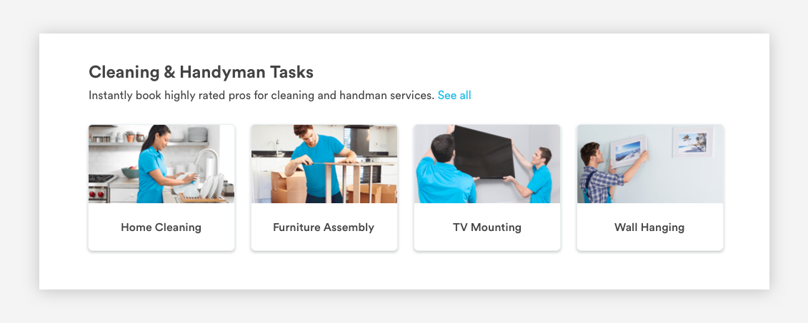

# Cards

## **Card Usage**

### Service Cards

Service Cards are used to display service offerings, like Home Cleaning, and will direct the user to a more detailed page about the service when clicked on. They can be displayed in multiple layouts depending on the service offering and page view.



### Form Cards

Form cards are used to display form content, like payment details; however, this is only true for desktop. On mobile web, card ui hides and form content remains.

Refer to [Forms](https://app.gitbook.com/@handyguide/s/docs/web/forms) for more information. 

## Card Layouts

Service Cards can be displayed in multiple layouts: 3 \(4-column\), 4 \(3-column\), and 6 \(2 -column\). Each have 32 pixels of space between. Card widths align with the [grid](https://app.gitbook.com/@handyguide/s/docs/web/grid-and-layout) while card heights are flexible.


### Card Properties 

```text
radius: 5px;
border-style: solid;
border color: #E8EFF2;
box-shadow: 0px 2px 4px rgba(0, 0, 0, 0.2);
```


