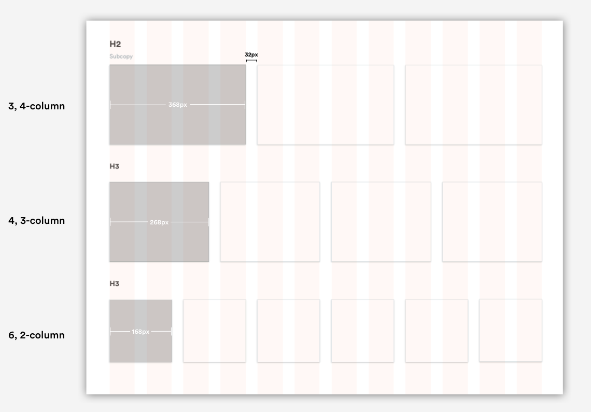

# Cards

## **Card Usage**

### Service Cards

Service Cards are used to display service offerings, like Home Cleaning, and will direct the user to a more detailed page about the service when clicked on. They can be displayed in multiple layouts depending on the service offering and page view.


### Form Cards

Form cards are used to display form content, like payment details; however, this is only true for desktop. On mobile web, card ui hides and form content remains.

Refer to [Forms](https://app.gitbook.com/@handyguide/s/docs/web/forms) for more information. 

## Card Layouts

### Content Cards

Service Cards can be displayed in multiple formats: 3 column, 4 column, or 6 column. Card widths always align with the [grid](https://app.gitbook.com/@handyguide/s/docs/web/grid-and-layout) with 32px gutter between each one, while card heights are flexible and fit to the content.



### Form Cards

[Form Cards](forms.md) come in two layouts: Wide, Primary cards and narrow, secondary car. 


### Card Properties 

```text
background-color: White #FFFFFF;
border-radius: 5px;
border-style: solid;
border color: #E8EFF2;
box-shadow: 0px 2px 4px rgba(0, 0, 0, 0.2)
```


