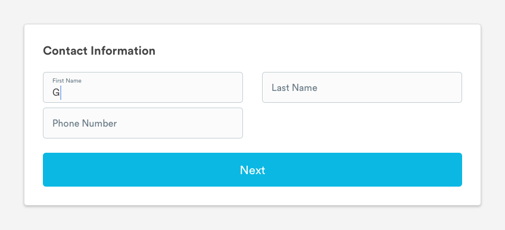
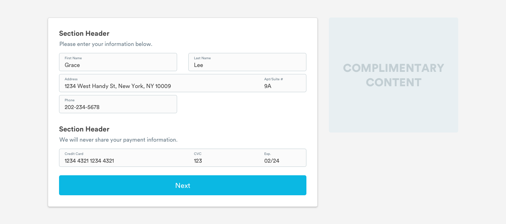
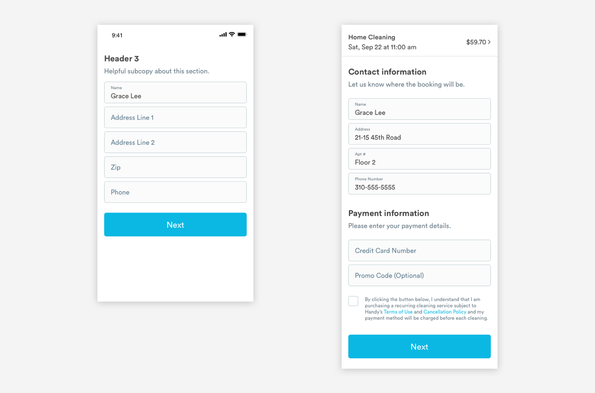
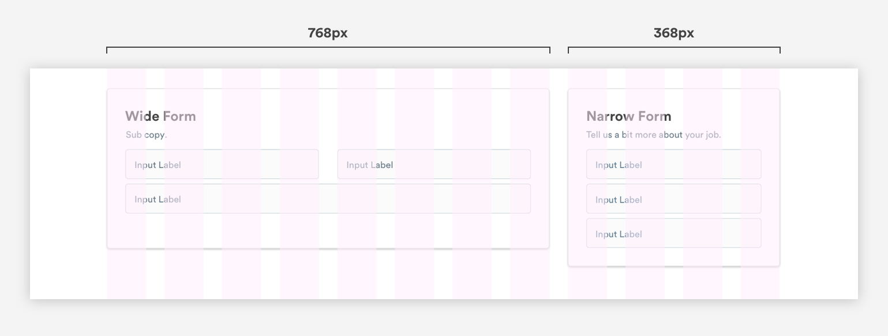
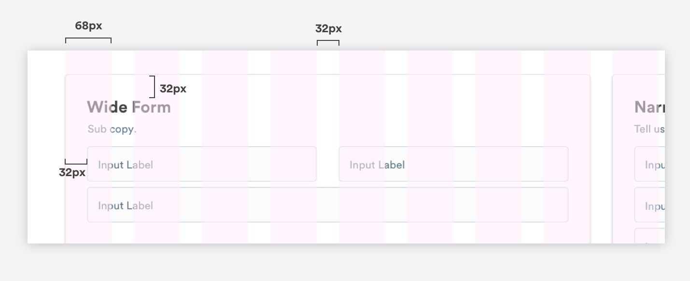
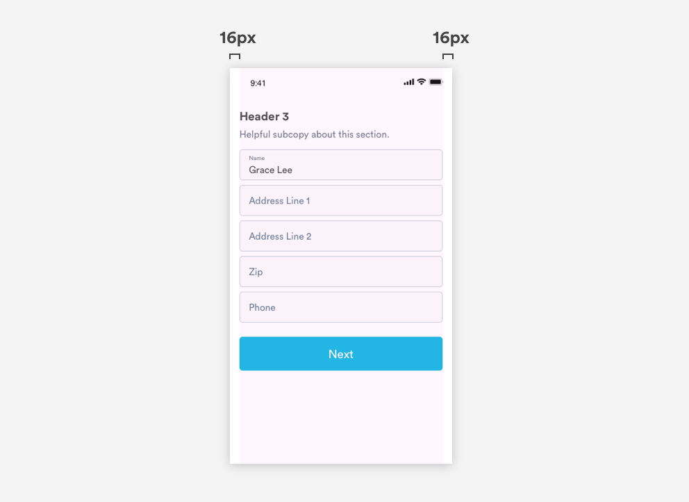
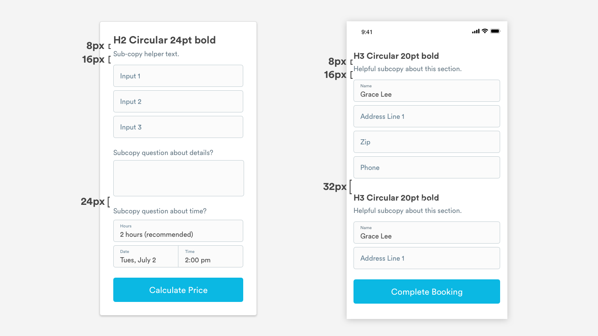
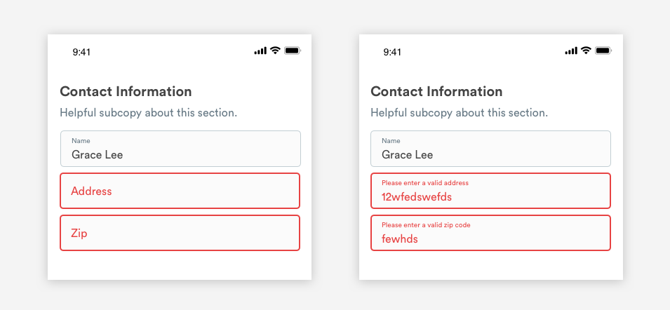

# Forms

## Usage of Forms

Forms are used when it makes sense to gather multiple pieces of information from users at once. For example we use forms to collect job details and payment information.



## Types of Forms

### Primary Forms \(Desktop Only\)

Primary forms are used when the primary purpose of the page is to collect information and move the user through an input flow. They are always sticky to the left side and take up 8 columns. 



### Secondary Forms \(Desktop Only\)

Secondary forms are used when the page is being used for multiple purposes.  For example, on our When pages, we are both building trust with service-related content and collecting job details. They are always sticky to the right side of the page and take up 4 columns.


### Mobile Web Forms

On mobile web, all forms follow the same format and all input fields become full-width. All card and background UI is hidden once we break to mobile web format. 



## Form Layout

### Grid

We use two form layouts on desktop: A primary, left-aligned form, and a secondary, right aligned form. Both are displayed on white cards with our standard drop shadow and 5-radius rounded corners. On mobile web, all forms follow the same format, with input fields spanning the full width of the screen and no cards or background. 







### Headers and Copy

We use [H2 headers or H3 headers](../brand-guidelines/typography-1.md) to label forms or sections of forms. Headers should be short and clearly define the group of input fields the cover. If needed, use subcopy in dark slate under the header. You can also use subcopy between input fields without adding another header, if the input fields live under the same header.



### Input Fields

We use the same input field UI across all forms \(same across desktop, mobile web, and native\). The only variable is the width of the input field. 


#### Inactive: Label or Placeholder Text

```text
font-family: Circular
font-weight: Book
font-size: 16pt
font-color: slate-medium-dark, #9CABB5
padding-left: 16px
padding-top: 16px
padding-bottom: 16px
```

#### Container

```text
border-radius: 5px
border: 1px
border color: slate-medium, #C2CED3
fill color: off-white, #FBFBFB
```

#### Active: Label

```text
font-family: Circular
font-weight: Book
font-size: 10pt
color: slate-medium-dark, #9CABB5
padding-left: 16px
padding-top: 8px
```

#### Active: Input Text

```text
font-family: Circular
font-weight: Book
font-size: 16pt
color: text-black, #434343
padding-left: 16px
padding-bottom: 8px
```

### Error States

We use the same error state UI across all forms. We have two error states: One for when the user has not yet entered anything into a required input field, and one for when they have entered invalid information.



#### Container: Color and border change

```text
border-radius: 5px
border: 2px
border color: red-medium, #E74343
fill color: off-white, #FBFBFB
```

#### Text: Color change

```text
text-color: red-medium, #E74343
```

### Buttons

Buttons always span the full width of the form content. We always use large buttons for forms. If a CTA in is required in the middle of a form, we use a special UI where the input field accommodates the CTA.

#### dfvsdv


