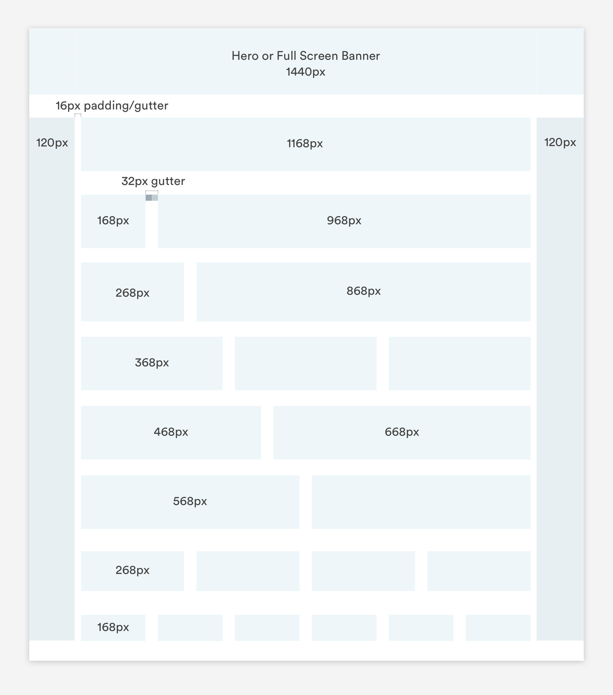
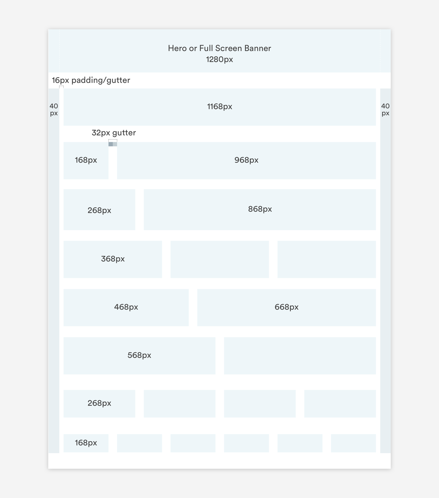
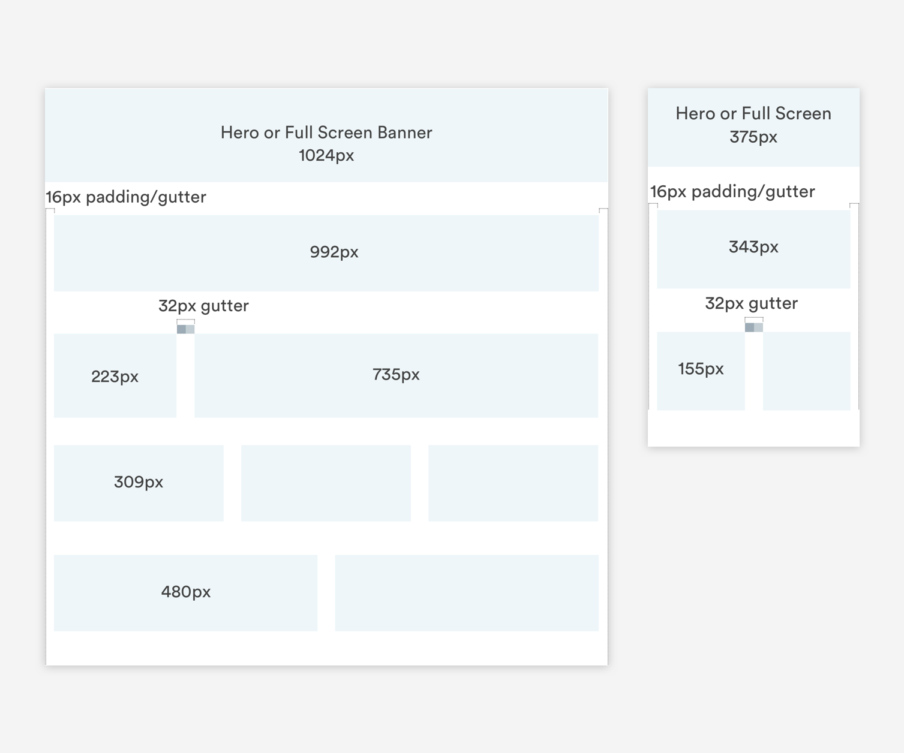
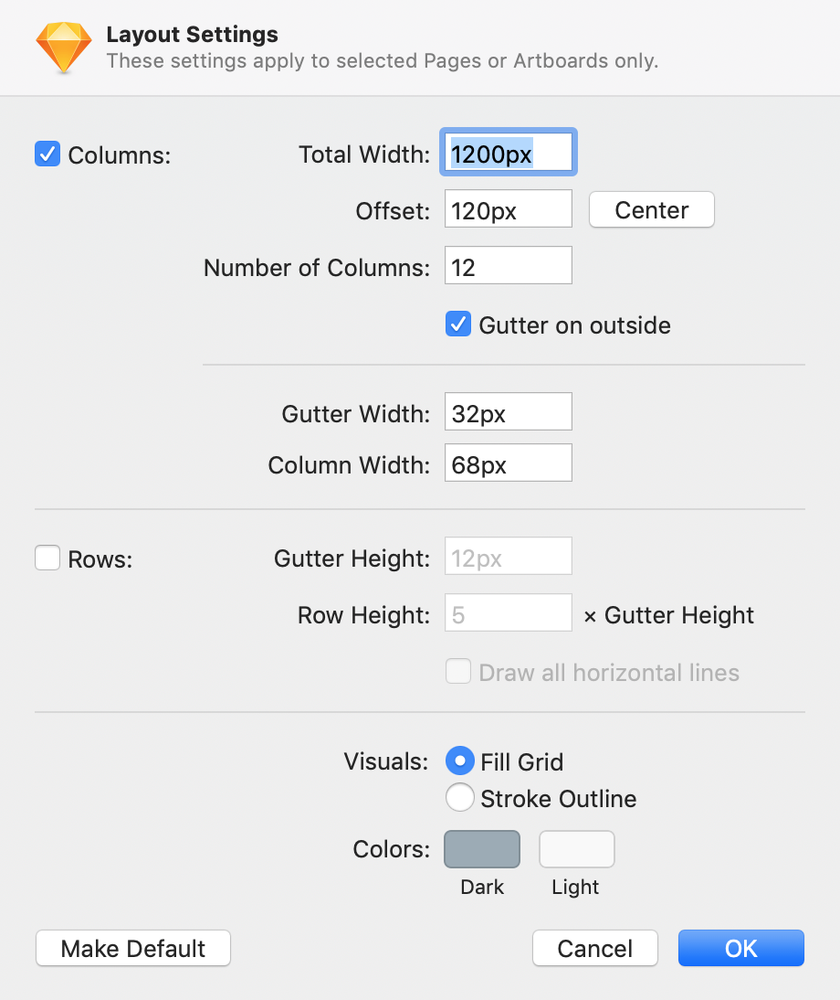
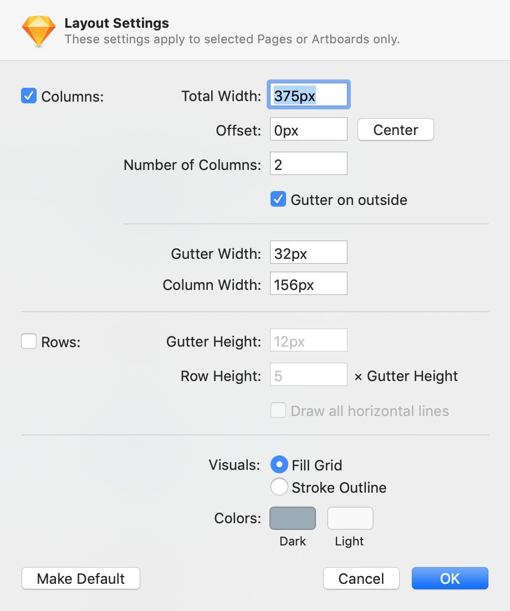

# Grid and Layout

## Grid by Screen Size

Designs must flex for both desktop and mobile web, but initial designs should be created with the most-used screen size in mind. 

### Standard Desktop Grid 1440px

### Small Desktop Grid 1280px

### Tablet and Mobile Grid \(1024px and 375px\)

## Sketch Layout Settings

### Desktop: 1440px Wide

All desktop web designs should be created on a 1440px wide artboard. The below **Layout Settings** will render the correct grid on your artboard.

### Mobile: 375px Wide

All mobile web designs should be created on a 375px wide artboard. The below **Layout Settings** will render the correct grid on your artboard.

