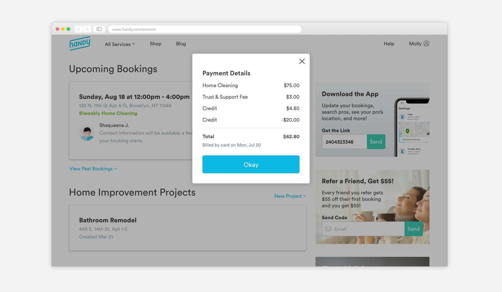
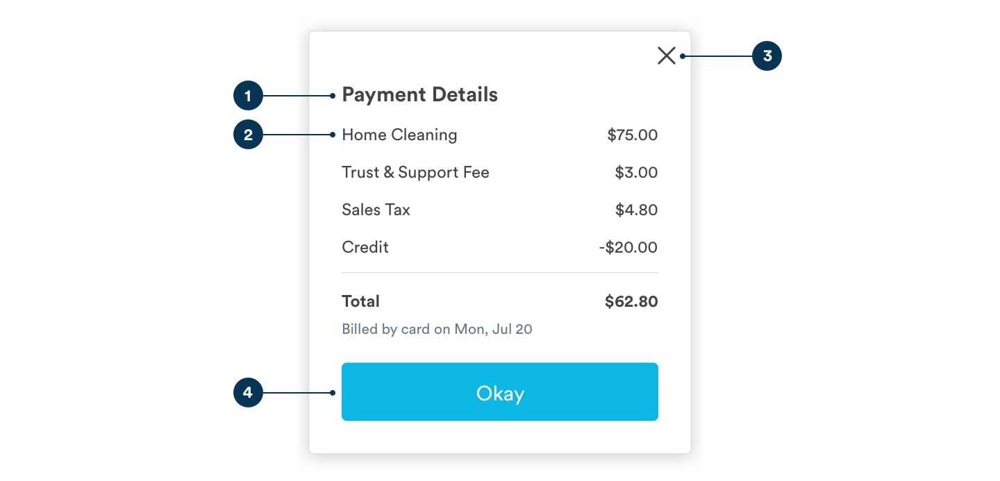
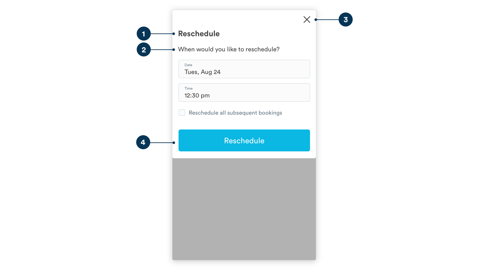
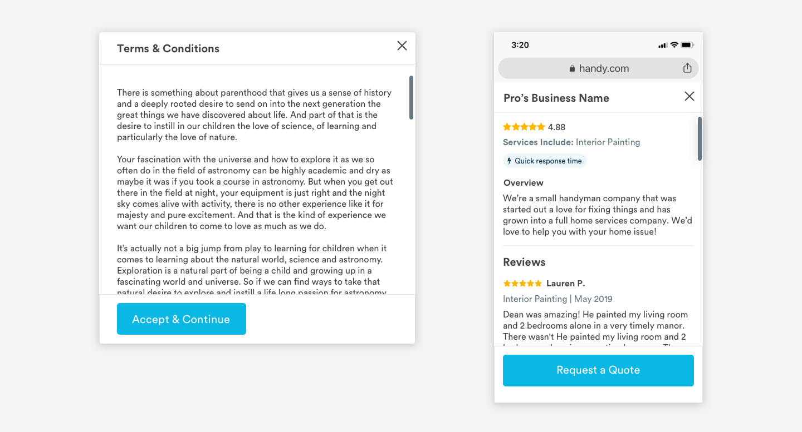

# Modals

## Usage of Modals

Modals disable page functionality in order to highlight information or isolate a required action. Modals should be used sparingly, open only when initiated by the user, and should not pop up unexpectedly when the user is in the middle of a flow. 

Exception: Exit intent or marketing offer modals that open automatically are acceptable when the user is idling on the page for an extended period of time.



## Anatomy of Desktop Modal



1. Header

```text
font-size: 20px
font-weight: bold
font-color: text-black #434343
padding-top: 48px
padding-left: 32px
```

2. Content

```text
font-size: 16px
font-weight: book
font-color: text-black, #434343
padding-left: 32px
padding-right: 32px
padding-top: 16px
padding bottom: 16px
```

3. X

```text
Height: 16px
Width: 16px
Stroke: 2px
Color: text-black #434343
padding-top: 16px
padding-right: 16px
```

4. CTA

```text
font-weight: book
font-size: 20px
font-color: white
padding: 16px

border-radius: 5px
color: blue-medium #0bb8e3
padding-left: 32px
padding-top: 16px
padding-bottom: 32px
```

## Anatomy of a Mobile Web Modal



1. Header

```text
font-size: 20px
font-weight: bold
font-color: text-black #434343
padding-top: 48px
padding-left: 16px
```

2. Content

```text
font-size: 16px
font-weight: book
font-color: text-black, #434343
padding-left: 32px
padding-right: 32px
padding-top: 16px
padding bottom: 16px
```

3. X

```text
Height: 16px
Width: 16px
Stroke: 2px
Color: text-black #434343
padding-top: 16px
padding-right: 16px
```

4. CTA

```text
font-weight: book
font-size: 20px
font-color: white
padding: 16px

border-radius: 5px
color: blue-medium #0bb8e3
padding-left: 16px
padding-top: 16px
padding-bottom: 16px
```

## Modal Sizes

On desktop, large modals have a max width of 568px and small modals are 368px wide. These widths align to our [desktop grid](grid-and-layout.md). On mobile web screens, modals should always be 100% of the screen width \(375px for standard iphone sizes\). 


```text
Desktop:
container-max-width: 568px
container-min-width: 368px
container-max-height: 560px

Mobile:
container-max-wdith: 100% 
container-max-height: 100%
```

## Scrolling Modals

If modal content exceeds the container max height on desktop or mobile web, we switch to a modal with scroll functionality. For scrolling modals, the header and footer + CTA stick to the top and bottom of the container, and the information in the center scrolls up and down. 




Sticky Header

```text
background-color: white #ffffff
line: 1px, grey-medium-light

Title
font-size: 20px
font-weight: bold
font-color: text-black #434343
padding-top: 16px
padding-left: 16px

X
Height: 16px
Width: 16px
Stroke: 2px
Color: text-black #434343
padding-top: 16px
padding-right: 16px
```

Sticky Footer

```text
background-color: white #ffffff
line: 1px, grey-medium-light

Button
font-weight: book
font-size: 20px
font-color: white
padding: 16px

border-radius: 5px
color: blue-medium #0bb8e3
padding-left: 16px
padding-top: 16px
padding-bottom: 16px
```

