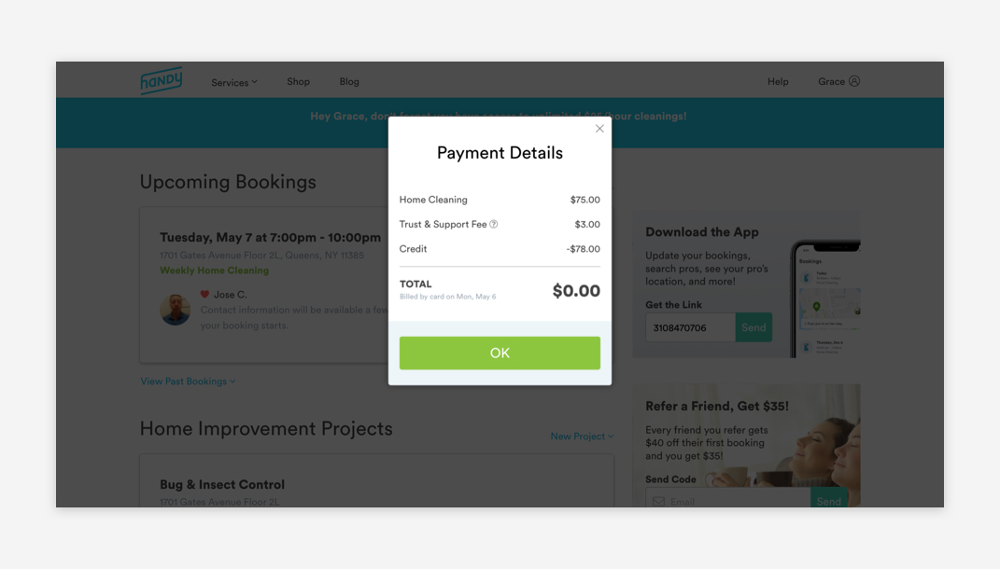

# Modals

## Usage of Modals

Modals disable page functionality and display receipt information or require an action from users.



## Anatomy of Desktop Modal

Modals can be found on the payment page. 


1. Modal Title

```text
font-weight: book;
font-size: 24px;
font-color: text-black;
padding-top: 32px;
```

2. Content

```text
font-weight: book
font-size: 16px
font-color: text-black
padding: 16px
```

3. CTA 

```text
font-weight: book
font-size: 20px
font-color: white
padding: 16px

border-radius: 5px
color: green-medium
padding-left: 16px
padding-right: 16px
padding-top: 24px
padding-bottom: 24px
```

## Modals on Mobile Web 

