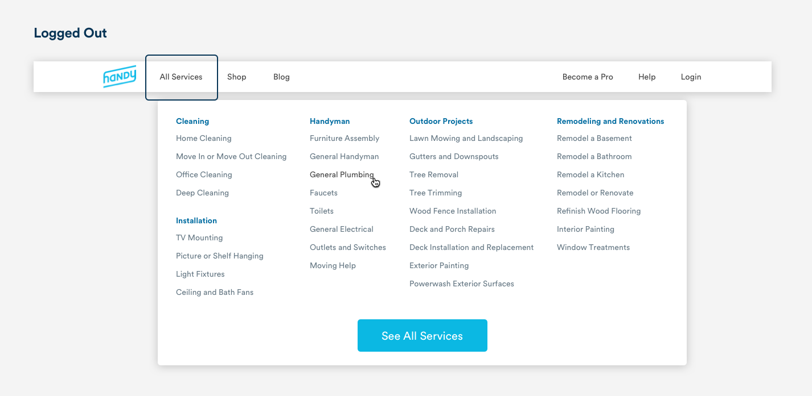
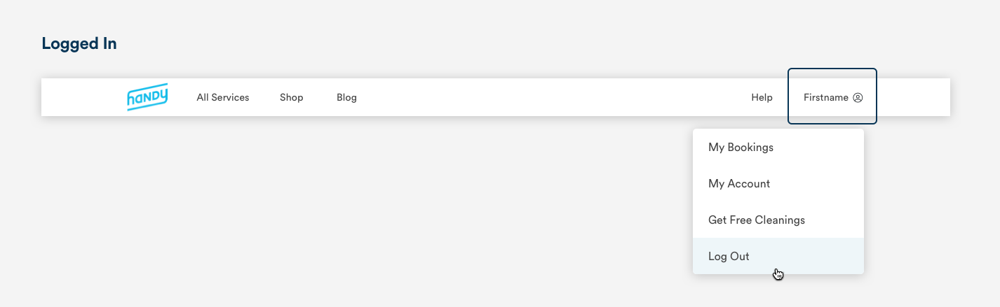
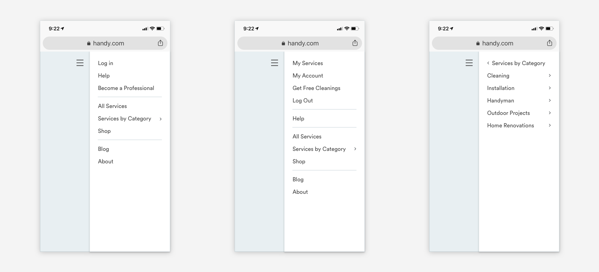

# Navigation

## Desktop

The menu bar at the top of our desktop screen provides easy access for the most important and most used pages on our site. The Handy logo is always on the far left and takes users to the home page, and the log in or account information is always on the far right. The navigation items align with our desktop [grid](grid-and-layout.md).


```text
Handy Logo: 64px max-width
Padding-left: 32px

Font-weight: Book 
Font-color: Text Black #434343
Top-padding: 20px
Bottom-padding: 20px
Left-padding: 24px
Right-padding: 24px
```

### Drop Downs

The Handy desktop navigation has two active [drop down](pickers.md#dropdown-menus) menus. The All Services menu is always always present, and the user Account menu is available for logged in users. 





## Mobile Web

The Handy mobile web menu is housed in a hamburger icon in the top right corner of the screen and mirrors the options from desktop. The mobile web menu opens by pushing screen content to the left. We use [angle-right](../brand-guidelines/line-icons.md) FontAwesome carets to indicate a list item that will push you one level deeper into the menu list. If a list item has no caret, it will take users to a new page when tapped. 



```text
Background-color: White #FFFFFF
Shadow: #000000, R:0; G:0; B:0, Alpha: 20%, 4px blur
Max-width: 232px
```

```text
font-color: Text-black #434343
font-size: 16pt
font-weight: Book
padding-left: 24px
padding-top: 8px
padding-bottom: 8px

Line-color: Slate-medium-light #DAE2E6
```

