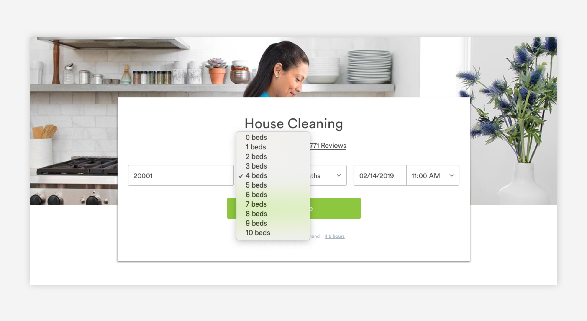

# Pickers

## Dropdown Pickers

Dropdown pickers are used when there are multiple, predetermined options for a given input. The drop down menu itself is rendered in the default HTML styling. On desktop, the drop down opens on click. On mobile, the menu opens on tap. 

## Dropdown Menus

Drop down menus allow users to quickly navigate to relevant pages. They are used to house options that will take users to a new page or modal. Options in the drop down menu can be text only, or include a line icon on the left. On desktop, they open on hover. On mobile, they open on tab. 

### Menu Design

## Steppers

Steppers are used to indicate a specific amount of one thing. 

## Page Tabs

Page tabs are used to move between multiple pages of content. 

