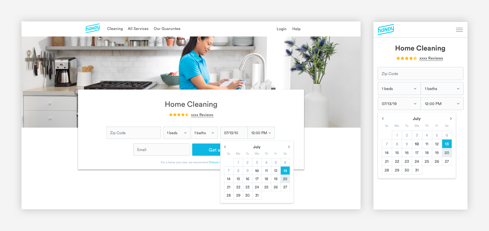

# Pickers

## Usage of Pickers

Pickers allow users to select an option before taking an action. Pickers can be found on When and Payment pages.

## Type of Pickers

[**1. Radio Pickers**](pickers.md#radio-pickers)  
****[**2. Checkboxes**](pickers.md#checkboxes)  
****[**3. Steppers**](pickers.md#steppers)  
****[**4. Date Picker**](pickers.md#date-picker)  
****[**5. Selector with Images**  
](pickers.md#selectors)\*\*\*\*[**6. Dropdown Pickers**](pickers.md#dropdown-pickers)  
****[**7. Dropdown Menu**](pickers.md#dropdown-menus)  
****[**8. Page Tabs**](pickers.md#page-tabs)\*\*\*\*

## Radio Pickers

Radio buttons are used when there is a list of two or more options that are _mutually exclusive_ and the user must select one choice. Radio groups must be stacked vertically.


1. Current Selection

```text
max-width: 24px
max-height: 24px

border: 1px
border-color: blue-medium

Fill:
color: blue-medium
size: 16px

padding-right: 16px
```

2. Content

The content must be positioned 16px to the right of the radio button. 

```text
font-weight: book
font-size: 16px
font-color: text-black
```

3. Unselected Options

```text
max-width: 24px
max-height: 24px

border: 1px
border-color: slate-medium
```

4. Dividing Line

The width of dividing lines are variable based on the context. Standalone dividers can take up to 12 columns. 

Dividers within cards need to have 32px padding on the left and right, in order to have separation within the card.

```text
border: 1px
color: slate-light

padding-top: 16px
padding-bottom: 16px
```

## Checkboxes

Checkboxes are used when the user can select multiple options. For example, adding extras in the booking flow. Each checkbox is independent of all other checkboxes in the list.


1. Current Selection: There can be multiple selections.

```text
max-width: 24px
max-height: 24px
border-radius: 3px
color: blue-medium

padding-right: 16px
```

2. Content

The content must be positioned 16px to the right of the radio button. 

```text
font-weight: book
font-size: 16px
font-color: text-black
```

3. Unselected Options

```text
max-width: 24px
max-height: 24px
border-radius: 3px
border: 1px
border-color: slate-medium
```

4. Dividing Line

Width of dividing lines are variable based on the context. Standalone dividers can take up to 12 columns. 

Dividers in cards need to have 32px padding on the left and right and 16px on mobile, in order to have separation within the card.

The width of dividing lines are variable based on the context. Standalone dividers can take up to 12 columns. Dividers in cards need to have 32px padding on the left and right and 16px on mobile, in order to have separation within the card.

```text
border: 1px
color: slate-light 

padding-top: 12px
padding-bottom: 12px
```

## Steppers


Steppers are used to indicate a specific amount of one thing. 


1. Engaged Stepper

```text
Container:
max-width: 32px
max-height: 32px
color: blue-light

Icon:
float: centered
color: slate-dark
```

2. Disengaged Stepper

Disengaged steppers are present when a user has reached 0.

```text
Container:
max-width: 32px
max-height: 32px
color: blue-light

Icon:
float: centered
color: slate-medium
```



## Date Picker

Date pickers are used when users are asked to enter their desired service date on When pages. On mobile web, date pickers will be the native date picker.   


1. Container

The width of the container will match the width of the corresponding dropdown picker. 

```text
color: white
border-radius: 5px
border-color: slate-light
border-width: 1px
drop-shadow: 0px 0px 2px 4px rbg(0,0,0,.2)
padding: 16px
max-width: 320px
```

2. Calendar Structure

The width of the calendar will depend on the width of the container. There will be 16px padding around the whole calendar. 

```text
border-color: slate-medium-light
border-width: 1px
padding: 16px
max-width: 280px
```

3. Typography

The width of the dates and the border around the dates are dependent on the size of the container and calendar. The container should be 1:1 around the dates should be 1:1.

```text
Month:
font-weight: bold
font-size: 16px
text-color: text-black

Days:
font-weight: book
font-size: 16px
text-color: slate-medium-dark
max-width: 40px
padding-top: 8px
padding-top: 8px

Past Dates:
font-weight: book
font-size: 16px
text-color: slate-medium-dark
max-width: 40px
padding-top: 8px
padding-top: 8px

Current Date:
font-weight: bold
font-size: 16px
text-color: text-black
max-width: 40px
padding-top: 8px
padding-top: 8px

Selected Date:
font-weight: bold
font-size: 16px
text-color: white
max-width: 40px
padding-top: 8px
padding-top: 8px

Future Dates:
font-weight: book
font-size: 16px
text-color: text-black
max-width: 40px
padding-top: 8px
padding-top: 8px
```

4. Selected State:


```text
color: medium-blue

Selected Date:
font-weight: bold
font-size: 16px
text-color: white
```

5. Hover State:

```text
color: slate-light

Hover Text:
font-weight: book
font-size: 16px
text-color: text-black
```

## Selectors

Selectors can be used in lieu of radio buttons to add more imagery onto a page. They can be found on payment or build pages.


1. Container

```text
border-radius: 5px
border-color: slate-medium
border-width: 1px
```

2. Icon

```text
color: slate-medium
max-height: 32px

padding-top: 16px
padding-bottom: 16px
```

3. Label

```text
font-weight: Book
font-size: 16px
font-color: text-black

padding: 12px
```

4. Selected Container

```text
border-radius: 5px
border-color: blue-medium
border-width: 3px
```

5. Selected Icon


 

```text
max-height: 32px

padding-top: 16px
padding-bottom: 16px
```

6. Selected Label

```text
font-weight: medium
font-size: 16px
font-color: blue-medium
```

## Dropdown Pickers

Dropdown pickers are used when there are multiple, predetermined options for a given input. The drop down menu itself is rendered in the default HTML styling. On desktop, the drop down opens on click. On mobile, the menu opens on tap.


1. Content: Will show the default option upon load

```text
font-weight: Book
font-size: 16px
font-color: text-black

padding-left: 16px
padding-top: 16px
padding-bottom: 16px
```

2. Caret: Must have caret to show that there are options.

```text
padding-right: 16px
```

3. Structure  
Width is depends on context. 

```text
border-radius: 5px
border: 1px
border color: slate-medium
```

4. Input Area

```text
background-color: off-white
```

## Dropdown Menus

Drop down menus allow users to quickly navigate to relevant pages. They are used to house options that will take users to a new page or modal. Options in the drop down menu can be text only, or include a line icon on the left. On desktop, they open on hover. On mobile, they open on tab. 


#### Menu Animation


## Page Tabs

Page tabs are used to move between multiple pages of content. 


1. Typography

```text
font-weight: Book
font-size: 16px

Default:
font-color: text-black

Selected:
font-color: white

padding-right: 32px
padding-left: 32px
```

2. Selection  
After the 3, the selection must stay in the middle.

```text
color: medium-blue

padding-right: 32px
padding-left: 32px
```

3. Carets

```text
font-family: fontawesome
font-size: 24px

padding-right: 64px
padding-left: 64px
```

