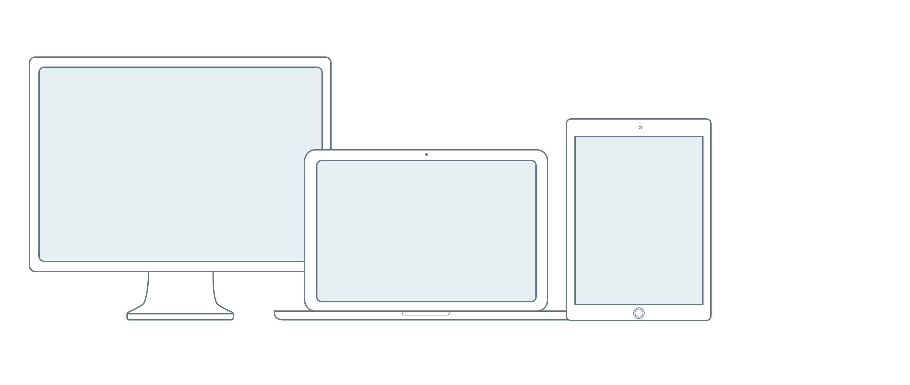

# Typography

## Desktop and Tablet

For screens larger than 1024px wide.

| Name |  | Font | Line Spacing |
| :--- | :--- | :--- | :--- |
| H1 |  | Circular-Bold 40pt | 1 |
| H2 |  | Circular-Book 32pt | 1 |
| H3 |  | Circular-Book 24pt | 1 |
| P |  | Circular-Book 16pt | 1.5 |

## Mobile

For screens smaller than 1024px wide.

| Name |  | Font | Line Spacing |
| :--- | :--- | :--- | :--- |
| H1 |  | Circular-Bold 28pt | 1 |
| H2 |  | Circular-Book 24pt | 1 |
| H3 |  | Circular-Book 20pt | 1 |
| P |  | Circular-Book 16 | 1.5 |

