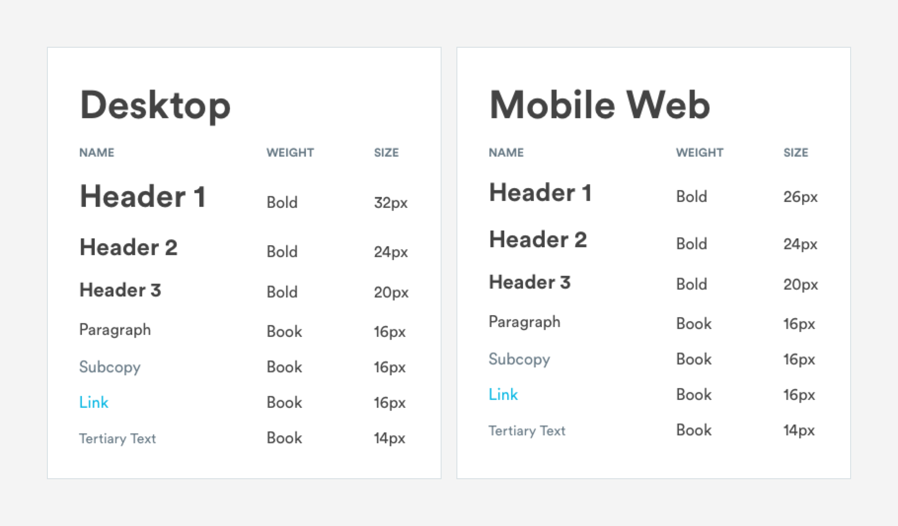
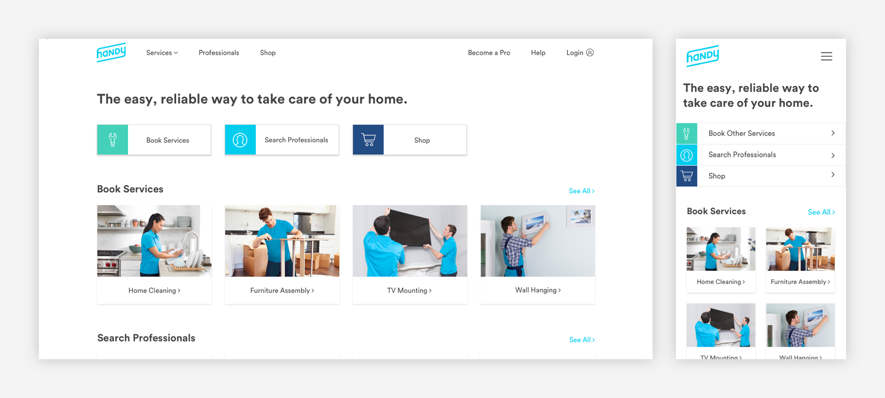
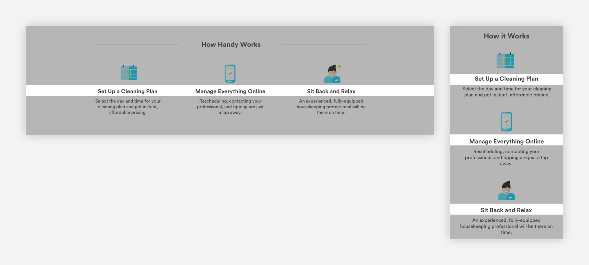
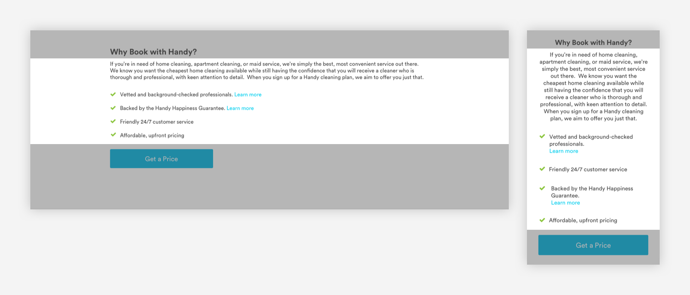
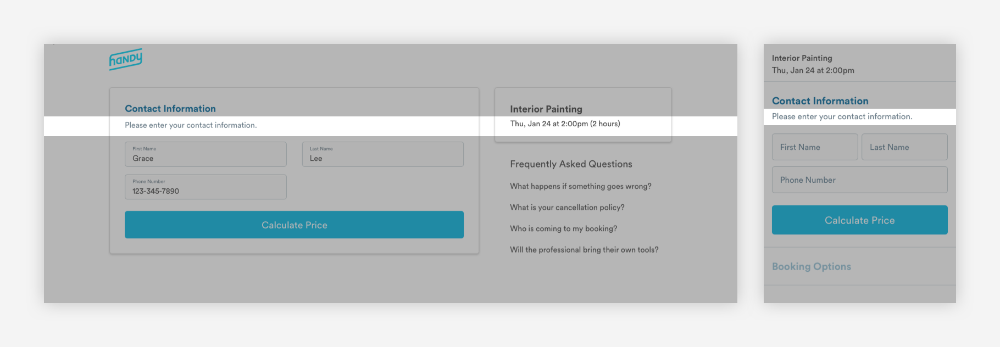
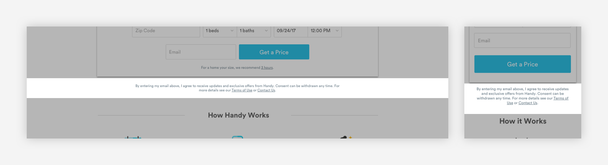

# Typography - Web

## Typography System for Web

Handy's web typography system is optimized for simplicity and enables streamlined experiences between desktop and mobile web. Besides headers, all type styles will stay the same between desktop and mobile web.

1. Header 1  
1a. H1-Desktop  
1b. H1-Mobile Web  
2. Header 3  
3. Paragraph  
4. Subcopy  
5. Link  
6. Tertiary Text



## Header 1

H1's are the only type element that changes based on the size of the screen.

### H1 - Desktop

Header 1 styling is used for important page headers like the home page or when pages.

```text
font-weight: bold
font-size: 32px
font-color: text-black
```

### H1 - Mobile

Header 1 styling is used for important page headers like the home page or when pages.

```text
font-weight: bold
font-size: 26px
font-color: text-black
```



## Header 2

Header 2 styling is used as a main header in content blocks.

```text
font-weight: bold
font-size: 24px
font-color: text-black
```


## Header 3

Header 3 styling is used for headers in content blocks.

```text
font-weight: bold
font-size: 20px
font-color: text-black
```



## Paragraph

Paragraph text is used for content.

```text
font-weight: book
font-size: 16px
font-color: text-black
line-height: 1.5
```



## Subcopy

Supporting copy that is often paired with H2s. Subcopy is used in forms.

```text
font-weight: book
font-size: 16px
font-color: slate-medium-dark
line-height: 1.5
```



## Link

Text links.

```text
font-weight: book
font-size: 16px
font-color: blue-medium
line-height: 1.5
```


## Tertiary Text

Tertiary text is used for legal copy, terms & conditions, etc.

```text
font-weight: book
font-size: 14px
font-color: slate-medium-dark
```



